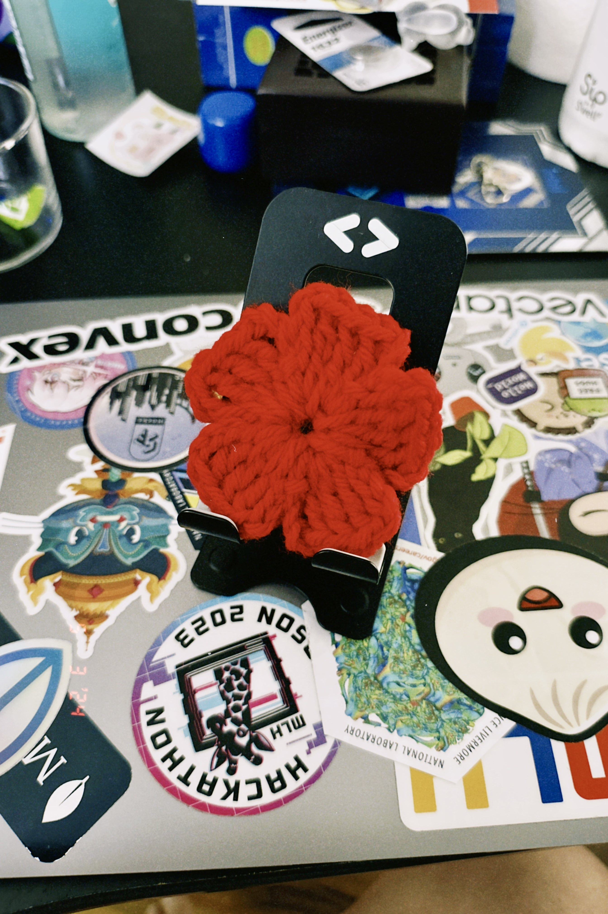

# Pokefruit
My first ever crochet plushy, created by two test pieces.

I started to pick up crocheting because I wanted a creative hobby. Now, I do have creative hobbies, but nothing had me create visually artistic pieces. I have always been interested in arts and crafts since childhood and tried exploring many of its avenues. 

However, I've been pretty unsucessful with sticking to anything. I like working with my hands and building things. Drawing, painting, and even instrument playing goes over my head (though I did play Alto Saxophone in high school). So far, I have been spent two days on crocheting and enjoy it a lot. The piece I have created here is an improvised gift I am calling "the Pokefruit."

<figure markdown="span">
  { width="300" }
  <figcaption>The Pokefruit</figcaption>
</figure>

<!-- more -->

## What it does
It's just a plushy with a noose. It can be held and squeezed like a stress ball, or hanged somewhere like a keychain.

## Development Process
I first started with wanting to create a Pokeball. However, due to a series of mistakes, I made the white-half too tall and narrow which I didn't realize until I started stiching the black "center." Realizing that it was too late, I decided to complete the red portion and attached the remaining into a noose so that the "Pokeball" was not completely ruined. I added polyester filling so that the shape would hold. The final product became a Pokeball-colored, acorn-shaped keychain. 

Not the greatest crochet ever, but it was my first piece and I like how it turned out.

<figure markdown="span">
  { width="300" }
  <figcaption>My improvised Pokeball</figcaption>
</figure>

Okay, I realized that I may have hit above my weight class. I thought a Pokeball would be pretty easy since it's just a sphere, but making the base circle and then incrementing it for each round of stitching was surprising complex. Now I want to do something easier so I went with a flower. I went online and found a tutorial on [crocheting a flower](https://www.youtube.com/watch?v=-Oygt5TJ7dE) that looked simple in design and process. It took around an hour-and-a-half to make this flower.

<figure markdown="span">
  { width="300" }
  <figcaption>Red flower</figcaption>
</figure>

I ended up combining these two by pulling the noose through the flower's center and then use a threaded needle to join the pieces together. While the thread is relatively unnoticable, a careful look would see that red thread tying the flower down.

## What I Learned
Crocheting is not a trivial task. I often see people crocheting at really rapid pace and in repetitive motions so I figured it had to be easy to learn. I think that's true, crocheting is still easy to learn. However, there's so much nuance to how you do anything from holding the yarn, to making a knot, to pulling the yarn or "yarn over." By far the most challenging task to me was learning a "crochet." Many YouTube videos and hours were spent to leearn how to do that. I still can't make a magic circle.

## Improvement Room
Given that the original intent was to create a pokeball, I think I need to be more conscious of how many stitches or crochets I'm doing. Keeping track of them would've helped me when I was looking at tutorials. I would still visit the pokeball later, but for the pokefruit, I think having a crochet needle would've helped kept the aesthetic of the pieces. 

The flower is slightly off center as well so I would need to realign it. Although it's not noticable, if the flower is removed it would be possible to see the stuffing through the top; I think I should use a smaller hook so the holes are tighter and not so easily loose for stuffing to spill out.